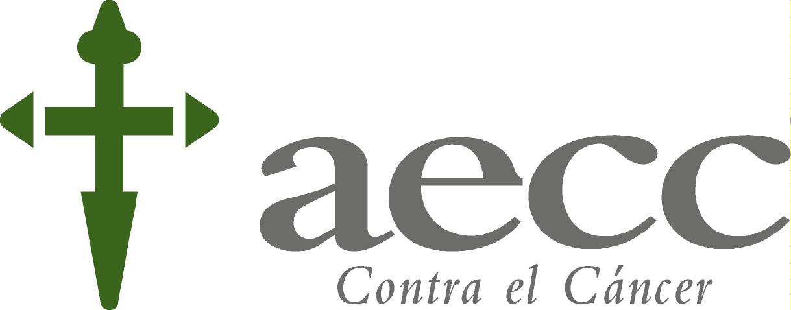
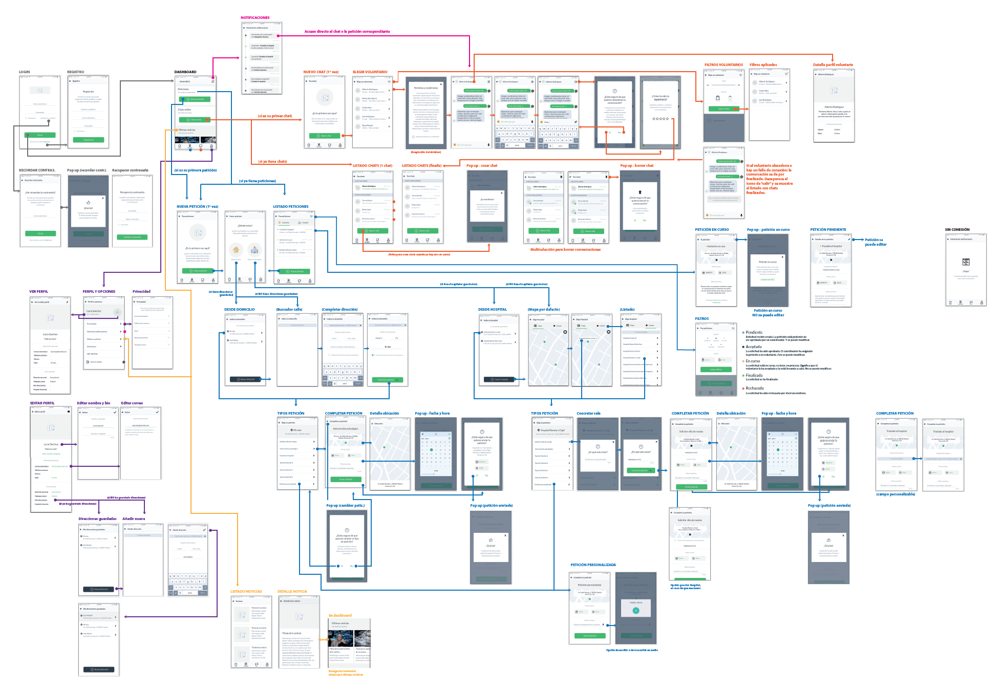
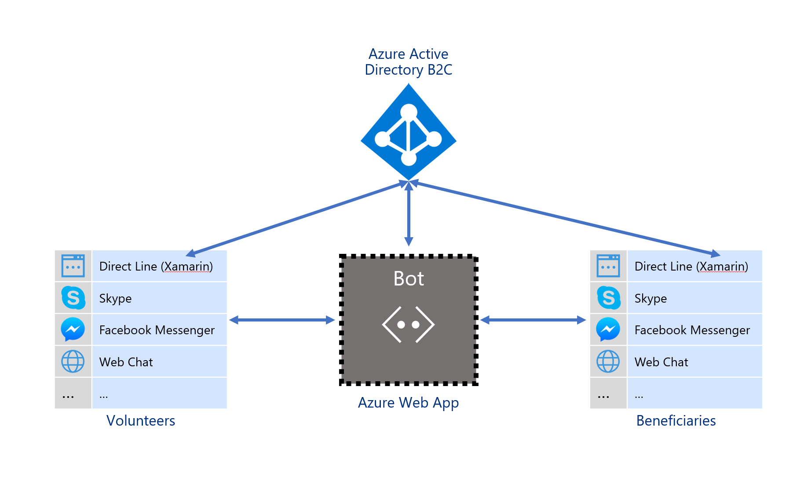
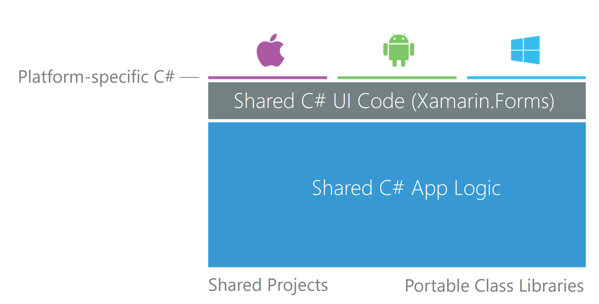
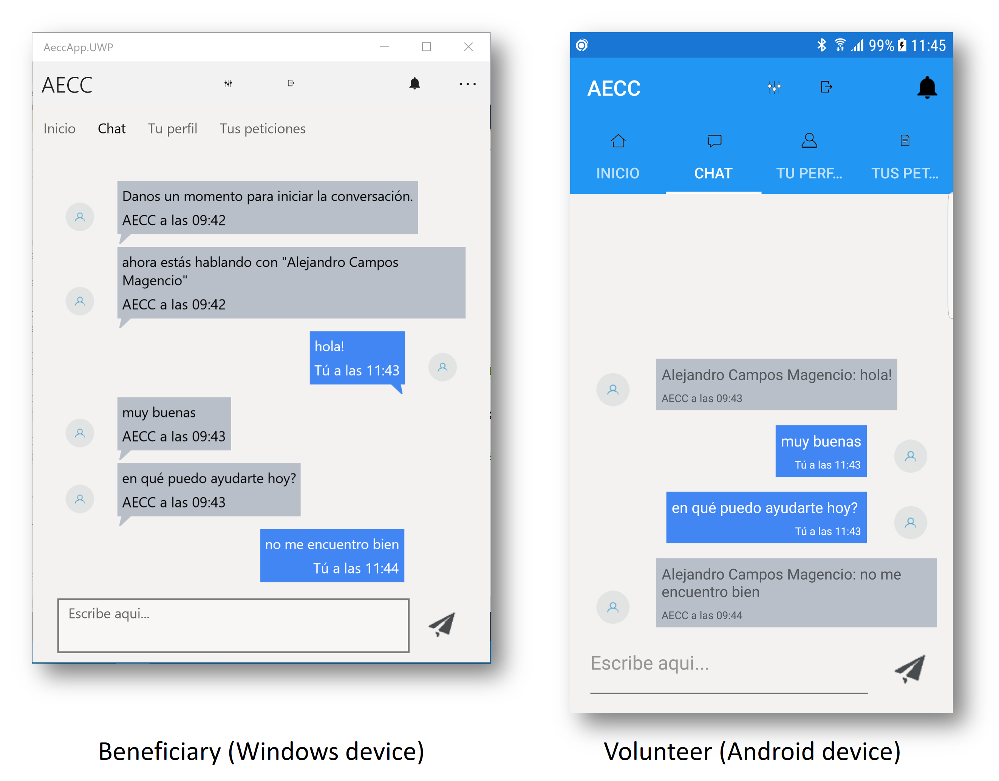
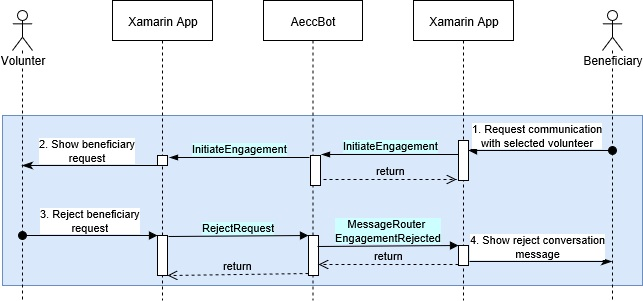
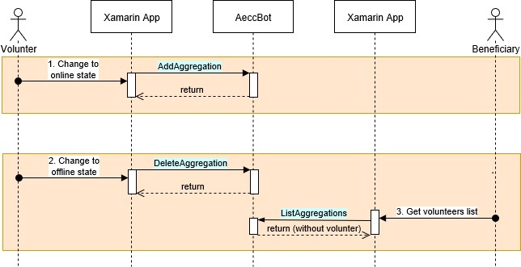

---
layout: post
title: "AECC (Asociación Española contra el Cáncer) leverages Microsoft Bot Framework to engage cancer patients and their families with volunteers in a more familiar way"
author: "Alejandro Campos Magencio"
author-link: "https://twitter.com/alejacma"
#author-image: "Images/authors/alejacma.jpg"
date: 2017-03-10
categories: [Conversations as a Platform]
color: "blue"
#image: "Images/ceucardenalherrera/image01-ceuuchlogo.png"
excerpt: AECC, Bravent and Microsoft have joined forces to
create a mobile app connected to a bot that will engage patients and their families with volunteers that will assist them during their fight against cancer. Learn how they used Xamarin, the Microsoft Bot Framework and Azure to achieve this.
language: English
verticals: Healthcare
---

### Solution overview
AECC, Bravent and Microsoft have joined forces to
create a cross-platform mobile app with Xamarin that levarages the Microsoft Bot Framework to connect patients and their families (a.k.a. beneficiaries) with volunteers that will assist them during their fight against cancer. 

### Key technologies
- We have used [Xamarin](https://xamarin.com) to develop a native cross-platform mobile app that will work on Windows 10, Android and iOS devices. 

- We have used [Microsoft Bot Framework](https://dev.botframework.com/) to create the bot that will act as the intermediary between patients and volunteers. The bot has been developed with [Bot Builder SDK](https://docs.botframework.com/en-us/csharp/builder/sdkreference/), C\# and Visual Studio 2017. We've registered and connected the bot to the Xamarin app thaks to [Bot Connector](https://dev.botframework.com/bots) and by enabling the Direct Line channel. We'll enable additional channels like Skype, Facebook Messenger and Web Chat (so the bot can be embedded in any web site) when needed.

- The bot is hosted in an [Azure Web App](https://azure.microsoft.com/en-us/services/app-service/web/), an [Azure](https://azure.microsoft.com) service that will allow the bot to auto scale, with load balancing, high availability, etc.

- The code has been hosted in a Git repository within [Visual Studio Team Services](https://www.visualstudio.com/team-services/). Continuous Deployment has been setup to automatically deploy the bot from Git to the Azure Web App.

- The app/bot requires both patients and volunters to authenticate, allowing them to use their credentials from social networks like Facebook. To achive this we used [Azure Active Directory B2C](https://azure.microsoft.com/en-us/services/active-directory-b2c/) (AAD B2C) and [Microsoft Authentication Library](https://www.nuget.org/packages/Microsoft.Identity.Client) (MSAL).

### Core team

**AECC**:
- **Juan Carlos Martin Tejada** - Development Team Leader
- **Antonio Crespo Sanchez** - IT Director

**Bravent**, an IT consulting company specialized in Microsoft tecnologies and an official Microsoft partner:
- **Alberto Fraj Souto** - Technical Lead (Mobility) - [\@alfraso](https://twitter.com/alfraso)
- **Mario Lopez Baratas** - Technical Lead (Mobility) - [\@mariobar](https://twitter.com/mariobar)
- **Pedro Sanchez Naranjo** - Backend Senior Developer

**Microsoft**:
-   **Isabel Cabezas Martín** – Technical Evangelist -
    [\@isabelcabezasm](https://twitter.com/isabelcabezasm)
-   **Alejandro Campos Magencio** – Technical Evangelist -
    [\@alejacma](https://twitter.com/alejacma)
-   **Diego Martínez Gil** – Technical Evangelist -
    [\@diegomrtnzg](https://twitter.com/diegomrtnzg)
-   **Daniel Mitchell** – Technical Evangelist Intern -
    [\@danymitb](https://twitter.com/danymitb)
-   **Daniel Ortiz** – Technical Evangelist Intern -
    [\@ortizlopez91](https://twitter.com/ortizlopez91)
        
## Customer profile

**AECC** ([Asociación Española Contra el Cáncer](https://www.aecc.es/Paginas/PaginaPrincipal.aspx)) integrates patients, their families, volunteers and professionals who work together to prevent, raise awareness, accompany people and finance Oncology research projects that will allow a better diagnosis and treatment of cancer.

They fight against cancer by leading the effort of the Spanish society to reduce the impact caused by this disease and improve the lives of people.

### Why Microsoft?

Microsoft provides the best technology and tools required to create a solution like this.  
With Xamarin we can create a native cross-platform app that works in Windows, Android and iOS devices.  
With Microsoft Bot Framework we can create a single bot that we can connect to the Xamarin app and any other channel required in the future (Skype, Facebook Messenger, etc.). The bot will act as intermediary between patients and volunteers.
With Azure we can deploy the bot in a Web App (Platform as a Service) to get auto scaling, load balancing, high availability, etc., without worrying about installing and configuring machines. We can also authenticate users with Active Directory B2C.

## Problem statement

The main target of this project is to develop the first mobile app that connects beneficiaries (cancer patients and their families) with AECC's highly trained volunteers.

AECC is struggling to reach young people. At the moment they have to communicate via phone (call center) to engage with volunteers. AECC would like to use a more modern way for people to communicate. They proposed the usage of a chat app so youngsters can use their mobile phones to communicate with volunteers in a closer way.  
Additionally, they would like to incorporate a module to the app that beneficiaries can use to handle all kind of requests to the different services AECC provides in each region.

AECC, Bravent and Microsoft strongly believe that the development of this app will allow AECC to reach a higher number of people, specially young people. It will increase the visibility and awareness of the Association as well as its number of members and volunteers.

## Solution and steps

### Scope of the technical engagement

Bravent met with AECC to define the scope of the complete project, and they came up with a functional definition of the mobile app:

Microsoft and Bravent joined forces during a 5 days technical engagement to create a Proof of Concept of the mobile app. 

This PoC covered the following parts of the app: 
- Volunteers use the mobile app to announce their availability. 
- A beneficiary uses the mobile app to find a volunteer to talk to. 
- The mobile app allows beneficiaries and volunteers to chat to each other.
- The mobile app must authenticate users to tell who is a volunteer and a beneficiary, and provide a custom experience.

### Envisioning

We decided to develop the app with Xamarin, which allows us to create a native cross-platform app that works accross platforms like Windows 10, Android and iOS.

We decided to use Microsoft Bot Framework as the backend of the app for the following reasons:

- Bot Framework already allow us to handle all communication between the client app and the bot, and between two client apps with the bot as an intermediary. This way we don't need to create our own backend from scratch.
- At the moment, users will communicate from the mobile app. Bot Framework supports a channel called Direct Line that allows us to convert our Xamarin app in a custom client for the bot. But in a near future, users should be able to communicate from any other channel e.g. Skype, Facebook Messenger or in a Web Chat control embedded in a web site. We will be able to use the same bot with very little modifications to achieve this.

This is the final architecture of the PoC:

## Technical delivery

### Xamarin app

As we mentioned before, we can use [Xamarin](https://developer.xamarin.com/) to develop a native cross-platform app that works in Windows 10, Android and iOS. We can develop this app with Visual Studio and C#, and reuse a lot of our C# code between the different platforms. We decided to use [Xamarin.Forms](https://www.xamarin.com/forms), which allows us to share C# code, but also the presentation layer of the app with XAML and even data bindings. We can also use portable libraries to maximize code reuse and [plugins](https://github.com/xamarin/XamarinComponents) to access native APIs in a cross-platform and reusable way.

This is the way the app looks on Android when used by a volunteer and on Windows when used by a beneficiary while engaged in the same conversation: 

### Bot

We used the [Microsoft Bot Framework](https://dev.botframework.com/) to create our bot with ASP.NET, C# and Visual Studio. We then registered the bot in the [Bot Framework Dev Center](https://dev.botframework.com/) and [enabled Direct Line channel](https://docs.microsoft.com/en-us/bot-framework/channel-connect-directline) so the Xamarin app is able to interact with the bot.

The app then uses the bot to connect beneficiaries and volunteers. Note this is a very specific usage of a bot.   
Volunteers will use the bot to announce their availability to talk to beneficiaries.  
Beneficiaries will use the bot to find an available volunteer to talk to. Beneficiaries will then select a volunteer, and if the volunteer accepts the request, they will be engaged and will talk directly through the bot.

In order to achieve this we are using a bot design pattern called [Handoff to Human](https://docs.microsoft.com/en-us/bot-framework/bot-design-pattern-handoff-human).

To implement this design pattern we based our code in the [Intermediator Bot Sample](https://github.com/tompaana/intermediator-bot-sample), a bot built on Microsoft Bot Framework that routes messages between users on different channels. 

Beneficiaries and volunteers will interact with the bot via commands: commands for a volunteer to say she is available, for a volunteer to get a list of available volunteers, etc. The Xamarin app sends the commands to the bot on behalf of the users. Once users are engaged, they use the chat page of the Xamarin app to talk to each other through the bot.

This picture summarizes the basic flow of commands between the app and the bot to engage a beneficiary and a volunteer in a conversation:

This picture summarizes the flow of commands between the app and the bot when a volunteer rejects engaging with a beneficiary:

This picutre summarizes the flow of commands between the app and the bot when a volunteer disconnects from the app before engaging with a volunteer:

### Debugging the code of the bot locally

When debugging a bot locally, it is usually enough by running it within Visual Studio as any other ASP.NET app. In this particular case, as the bot is being accessed by the Xamarin app via Direct Line, we need the bot to be registered and Direct Line channel enabled for it. This requires the bot to be available on the Internet. We could just publish the bot on its Azure Web App and enable remote debugging with Visual Studio. Still, if we want to debug it locally, there is a solution:

1) Run the bot in Visual Studio to find out its local port, e.g. 56993. 

2) Download [ngrok](https://ngrok.com/) and run it with that port, to expose the bot running locally to the Internet:

`ngrok http 56993 -host-header="localhost:56993"`

3) Go to [Bot Framework Dev portal](https://dev.botframework.com/), register the bot using the address generated by ngrok, e.g. `https://d52fcb82.ngrok.io`, and get its Microsoft App Id and Password, for example:

Messaging endpoint: `https://d52fcb82.ngrok.io/api/messages`  
Microsoft App Id: `5d06708b-6381-48a7-b6d3-b37f712ea88d`  
Microsoft App Password: `iP93WU7zZrURqkGYbqcSmVO`

4) Activate Direct Line on the bot and get its key, for example:

Direct Line Key: `P9AvZA5uulA.cwA.gQw.wnzoallNNds3zGLJb-P3Wn0pFkWDhrai6RpsDnue6O0`

5) Set the Microsoft App Id and Password of the bot in its web.config, and execute the bot within Visual Studio.

6) Go to the Xamarin app's code and set the AeccBotSecret in its GlobalSetting class (AeccApp.Core PCL) to the Direct Line Key.

7) Then you can run the bot again within Visual Studio and access the bot via the Xamarin app. You may use e.g.  the Android version of the app for the patient and the UWP (Windows 10) version of the app for the volunteer, or the other way around.

### Authentication

We set an [Azure Active Directory B2C](https://azure.microsoft.com/en-us/services/active-directory-b2c/) (AAD B2C) to handle all users accessing the app, both volunteers and beneficiaries who will be using their social network credentials to access the app.

Then we handle authentication in the Xamarin app with [Microsoft Authentication Library](https://www.nuget.org/packages/Microsoft.Identity.Client) (MSAL) to find out if they are volunteers or beneficiaries. The app will behave in a different way depending on their role.

For authentication we use MSAL's [PublicClientApplication](https://docs.microsoft.com/en-us/dotnet/api/microsoft.identity.client.publicclientapplication?view=azure-dotnet) class and its [AcquireTokenAsync](https://docs.microsoft.com/en-us/dotnet/api/microsoft.identity.client.publicclientapplication.acquiretokenasync?view=azure-dotnet#Microsoft_Identity_Client_PublicClientApplication_AcquireTokenAsync_System_Collections_Generic_IEnumerable_System_String__Microsoft_Identity_Client_UIParent_) and [AcquireTokenSilentAsync](https://docs.microsoft.com/en-us/dotnet/api/microsoft.identity.client.clientapplicationbase.acquiretokensilentasync?view=azure-dotnet#Microsoft_Identity_Client_ClientApplicationBase_AcquireTokenSilentAsync_System_Collections_Generic_IEnumerable_System_String__Microsoft_Identity_Client_IUser_System_String_System_Boolean_) methods.

## Conclusion

### General lessons

- Xamarin.Forms is a great way to develop a native mobile app that works accross different platforms.

- We can use Bot Framework to enrich communication between people and machines, but we can also use it to simplify communication between people.

- Using the Bot Framework to create our backend is making it future-proof, as we can connect the bot to different channels that need to be supported in a near future without the need of creating a new backend/bot.

- Azure Active Directory B2C makes authenticating users outside of our organization easier.

### Opportunities going forward

- Be able to interact with the bot via Skype, Facebook Messenger and other channels, and not just from the Xamarin App. This will require to add the following features to the bot: 
1) AAD B2C authentication. Right now authentication is being handled by the Xamarin app. The bot should handle authentication too in case users talk to it directly.
2) Natural language processing with Language Understanding Intelligent Service ([LUIS](https://www.microsoft.com/cognitive-services/en-us/language-understanding-intelligent-service-luis)) for an easier interaction of patients and volunteers with the bot. Right now the interaction with the bot is done via commands sent by the Xamarin app itself.

- Improve the app and the bot so beneficiaries can use them handle all kind of requests to the different services AECC provides in each region.

- Release the project as an Open Source project in GitHub.

## Additional resources

- [Xamarin Documentation](https://developer.xamarin.com/). Your starting point with Xamarin.

- [Bot Framework Dev Center](https://dev.botframework.com/). Your starting point with bots.

- [Bot Framework Documentation](https://docs.microsoft.com/en-us/bot-framework/). Read it before you start building a bot, to learn everything you can do with them.

- [Official Bot Framework Team blog](https://blog.botframework.com/). Where you can learn what’s new.

- [Bot Directory](https://bots.botframework.com/). Where you can find bots published by other developers.

- [Bot Builder SDK in GitHub](https://github.com/Microsoft/botbuilder). Microsoft Bot Builder is an open source project. Check it out!

- [Channel Inspector](https://docs.botframework.com/en-us/channel-inspector/channels/Skype/). A very useful tool to check how the different messages will be shown in the different channels, along with limitations in those channels.